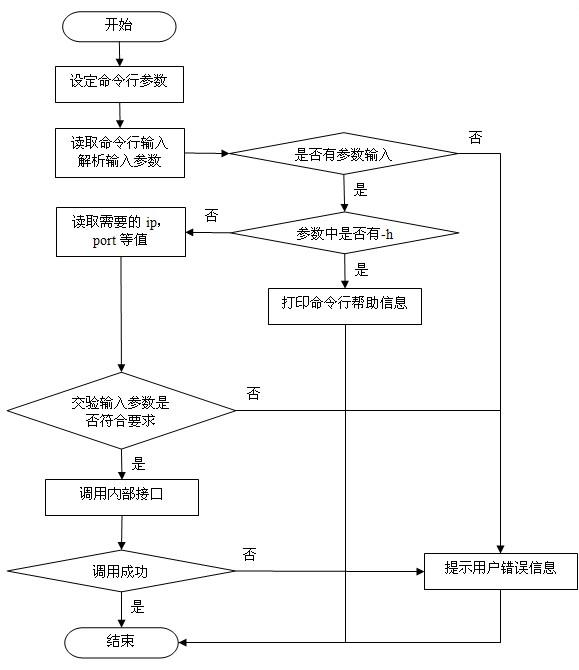

### Java命令行工具
#### 1. 实验背景
该作业为大作业的预热作业，我们将使用第三方库Commons CLI来编写一个简单的命令行工具。
实验的主要目的是通过这个作业理解什么是命令行工具并熟悉API的使用。

要实现一个命令行工具，需要经历三个过程：定义、解析、使用
- 定义：预定义一组可能的输入选项
- 解析：解析用户传入参数并检验正确性
- 使用：调用解析出的选项的业务逻辑

在命令行模式下运行java，输入java -h(**请先配置好环境变量**)我们可以得到以下的结果。
在安装时因为语言和版本的不同可能结果略有出入，不过这不影响理解。
```
用法: java [-options] class [args...]
           (执行类)
   或  java [-options] -jar jarfile [args...]
           (执行 jar 文件)
其中选项包括:
    -d32          使用 32 位数据模型 (如果可用)
    -d64          使用 64 位数据模型 (如果可用)
    -server       选择 "server" VM
                  默认 VM 是 server.

    -cp <目录和 zip/jar 文件的类搜索路径>
    -classpath <目录和 zip/jar 文件的类搜索路径>
                  用 ; 分隔的目录, JAR 档案
                  和 ZIP 档案列表, 用于搜索类文件。
    -D<名称>=<值>
                  设置系统属性
    -verbose:[class|gc|jni]
                  启用详细输出
    -version      输出产品版本并退出
    -version:<值>
                  警告: 此功能已过时, 将在
                  未来发行版中删除。
                  需要指定的版本才能运行
    ...
    ...

```

一个典型的命令行工具的流程图如下
<!--  -->


### 2. 实验要求
#### 2.1 实验输入
程序的输入是一个字符串，对于一个合法输入有以下的要求
- 如果一个选项带有必选参数，则参数必须存在且紧跟在选项，两者之间可以包括多个空格作为间隔
- 不要求 各选项和其可能带有的参数  与  其余参数(即用户参数)  的顺序关系
- **输入不包含-h选项时，必须带有至少一个用户参数**

#### 2.2 实验输出
程序的合法输出包括
- 在输入合法时，使用标准输出方法将业务逻辑的结果打印到控制台(如果有)
- 在输入不合法时抛出相应异常

#### 2.3 实验要求
在本次实验中需要完成以下参数的实现
格式说明： -开头为选项的简写，--开头为选项的全名，跟在后面的符号是选项的参数
|参数|主要功能|
|---|---|
|-h --help|打印出所有预定义的选项与用法|
|-p --print ：arg |打印出arg|
|-s|将CommandlineUtil中sideEffect变量置为true|

**注意**：为了方便构建测试用例，-h参数的输出结果以"help\n"作为标准输出进行检验。在通过测试用例后，鼓励同学们使用HelpFormatter设置help的输出内容。

其他要求：
1. -p选项缺少参数时应该在标准输出中打印ParseException的错误信息并使用System.exit(-1)退出程序
2. 无论处于整条指令的什么位置，只要使用了-h指令，其余指令失效。但其余参数仍需要是合法形式，否则采用第一条规则
3. 当不包含-h选项时，如果用户参数为空，则输出自定义错误提示(即WRONG_MESSAGE)

#### 2.4 代码指导
**在开始阅读这段指导之前，我们强烈建议直接阅读[官方文档](https://commons.apache.org/proper/commons-cli/usage.html)来获取你所需要的一切。这其中就有一个非常完整的实现示例。不要害怕，阅读完全文也就5-10分钟，之后你就可以用几十行代码实现我们的作业了~**

**在之后的大作业中我们不会提供详细到API级别的文档。因此，掌握阅读官方文档的能力十分重要。**


在CommandlineUtil中我们定义了三个静态变量
```java
    private static CommandLine commandLine;
    private static CommandLineParser parser = new DefaultParser();
    private static Options options = new Options();
```
其中，options是用来添加预定义的选项规则的，parser负责解析输入并把结果传给commandLine

Step1 创建Option [API](https://commons.apache.org/proper/commons-cli/javadocs/api-release/index.html) 
```java
采用以下方法之一完成option构造，调用形式为options.add(new Option(...))

方法1：
Option(String opt, boolean hasArg, String description)
Option(String opt, String description)
Option(String opt, String longOpt, boolean hasArg, String description)

方法2：
Option someOption = OptionBuilder.withArgName( "name" )
                                .hasArg()
                                .withDescription(  "description" )
                                .create( "someOption" );
```

Step2 解析输入 [API](https://commons.apache.org/proper/commons-cli/javadocs/api-release/index.html)
```java
parser.parse(options,args) //args即main函数的参数
```
 
Step3 处理选项 [API](https://commons.apache.org/proper/commons-cli/javadocs/api-release/index.html)
```java
首先获取参数
if( line.hasOption( "someOption" ) ) {
    // 如果存在可能的参数可以这样尝试获取
    this.someField = commandLine.getOptionValue( "someOption" );
}

也可以通过commandLine.getArgs()获取全部参数

获取完参数之后就可以调用自己的业务逻辑来实现要求了
```

格式化输出 [API](https://commons.apache.org/proper/commons-cli/javadocs/api-release/index.html)
```java
 String header = "header of help message";
 String footer = "footer of help message";
 
 HelpFormatter formatter = new HelpFormatter();
 formatter.printHelp("myapp", header, options, footer);
```
### 其他
如果你在使用时发现了作业设计中的bug，例如测试方法写错了之类的情况请用邮件联系助教。也欢迎其他关于文档的建议和反馈。

助教联系方式：hwh@smail.nju.edu.cn


